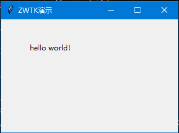

# 🚀 ZWTK - 中文GUI开发框架


**让Python GUI开发更简单直观的中文框架**

[](demo.gif)

## 📦 安装

```bash
pip install ZWTKINTER
```

## 🎯 特性

### 核心功能
- 🀄 全中文API命名
- 🧩 模块化组件设计
- 🎨 多主题支持
- 📱 响应式布局
- 🔌 插件扩展系统

### 控件支持
```text
✅ 窗口管理   ✅ 基础控件   ✅ 高级组件
✅ 布局系统   ✅ 事件处理   ✅ 样式定制
✅ 图像处理   ✅ 绘图功能   ✅ 定时任务
```

## 🚀 快速开始

```python
from ZWTKINTER import *

# 初始化应用
应用 = 初始化()

# 创建主窗口
主窗口 = 窗口(标题="示例程序", 尺寸=(800, 600))

# 构建界面
布局 = 网格布局()
布局.添加(标签("欢迎使用ZWTK"), 行=0, 列=0)
布局.添加(按钮("点击我", lambda: 弹窗("提示", "操作成功!")), 行=1, 列=0)

# 运行程序
应用.运行(主窗口, 布局)
```

## 📚 文档目录

### 核心模块
1. [窗口系统](#窗口系统)
2. [布局管理](#布局管理)
3. [基础控件](#基础控件)
4. [高级组件](#高级组件)
5. [事件处理](#事件处理)

### 扩展功能
- [主题定制](#主题定制)
- [插件开发](#插件开发)
- [性能优化](#性能优化)

## 🪟 窗口系统

### 创建窗口
```python
窗口配置 = {
    "标题": "我的应用",
    "宽度": 1024,
    "高度": 768,
    "可调整大小": True,
    "主题": "现代浅色"
}
我的窗口 = 创建窗口(窗口配置)
```

### 窗口操作
| 方法                | 参数            | 说明                  |
|---------------------|-----------------|-----------------------|
| `置顶窗口`         | `是否置顶=True` | 设置窗口置顶          |
| `全屏模式`         | `是否全屏=True` | 切换全屏显示          |
| `设置图标`         | `图标路径`      | 更改窗口图标          |

[查看完整窗口API](#窗口系统)

## 🧩 基础控件

### 按钮组件
```python
我的按钮 = 按钮(
    文本="提交",
    图标="submit_icon.png",
    样式="主要按钮",
    点击事件=lambda: 提交表单()
)
```

### 输入组件
```python
输入框 = 文本输入(
    提示文字="请输入姓名",
    默认值="张三",
    验证规则=验证.非空校验
)
```

## 🛠️ 项目结构
ZWTKINTER/
├── core/ # 核心模块
│ ├── window.py # 窗口管理
│ ├── layout.py # 布局系统
│ └── event.py # 事件处理
├── widgets/ # 控件库
│ ├── basic/ # 基础控件
│ └── advanced/ # 高级组件
├── themes/ # 主题文件
├── plugins/ # 插件系统
├── examples/ # 示例程序
├── docs/ # 文档
└── tests/ # 测试用例
## 🤝 参与贡献

1. Fork项目仓库
2. 创建特性分支 (`git checkout -b feature/新功能`)
3. 提交更改 (`git commit -am '添加新功能'`)
4. 推送到分支 (`git push origin feature/新功能`)
5. 创建Pull Request

## 📜 开源协议

本项目采用 [MIT License](LICENSE)  
Copyright (c) 2023 ZWTKINTER开发团队

---

[📖 完整文档](https://zwtkinter.my) | 
[🐞 问题反馈](https://zwtkinter.my) | 
[🐞 问题反馈](https://github.com/teachers10086/ZWTKINTER/issues）|
[💬 讨论区](https://github.com/zwtkinter/discussions)
